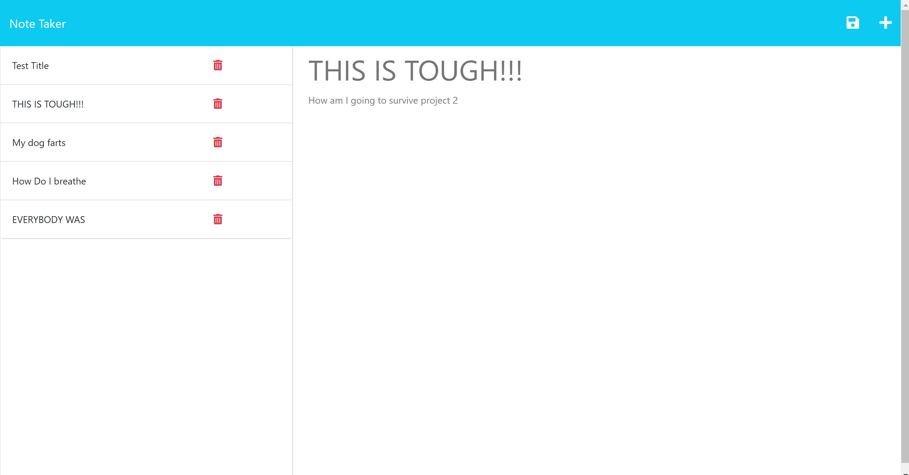

# Note Take My Notes • 

## Description

This project comprised of a completed app called Take my notes that uses the CRUD (CREATE, READ, and DELETE) method and store notes to a database for a better UI experience. Deployed and hosted by Heroku.

## Installation

- Required: node.js

### Link to deployed application

- [Click Here](https://takemynotes-79540f9bd0ca.herokuapp.com/)
- #### Notes taken and be stored in the database

## Credits

- UNC bootcamp collegues, Youtube, and chatGPT

## License

This application is covered under the [MIT License](./LICENSE)
